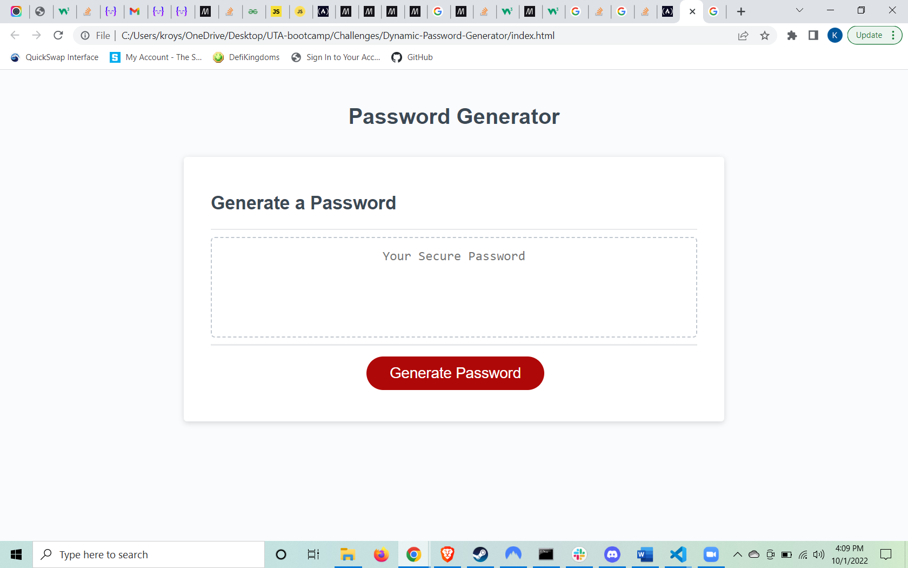

# **Dynamic-Password-Generator**

## **Description**

This is my Dynamic Password Generator. The focus was to create a random password generator with JavaScript. When a user clicks the 'Generate Password' button, they are given a series of prompts for their password. Once complete, the new password will be displayed in the text area. 

Github Repository - 

Application Screenshot - 